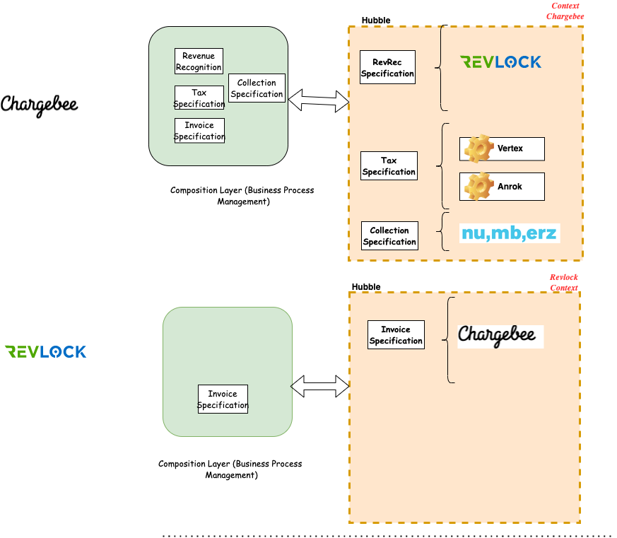

# Business Objective #
Hubble is aimed to make Chargebee an extensible platform with deep possible integrations. Hubble is envisioned to provide set of self serve to enable internal or external developers faster. 

## Guiding Principles ##
* We will actively discourage the word integrations. Integration becomes an implementation and needlessly decreases the business efficiency by adding technical debt in the system.  
*Eg-We will not say we are integrating with RevLock, we will say we are enhancing with Revenue Recognition Capability. This identifies and promotes the true problem to be solve for.*  

* Any business enablement we will think in terms of composition of capabilities. 
  
* Any capability we will define in terms of Open Interfaces. This promotes bounded context. This also demands clean and simpler interfaces. Clean interface is one which does not reveal the implementation detail thus discouraging accidental complexity seeping into the system.  
  
* Capabilities that can be extensible are expressible and readable by machine. This is needed to automate.  
  
* Capabilities expressed hides the implementation details. There can be multiple implementation for the same capability.  
  
* We measure inconvenience in terms of our in adaptability to change or too many changes because of  underlying implementation. Higher the inconvenience further we are from the goal!
  
* Capability Interfaces are most of the time backward compatible, are versioned and promotes selectivity.  
  
* We will use the above principles for evaluation of Commercial Off the Shelf (COTS) as well.  

### Overall Context ###

# Usecases #

# Key Architecture Decisions #

* Multi tenant
* Automation and Validation first
* System should is expected to make progress to recover from failures
* Systems fail in isolation and does not cascade failure
* System is observable under  all circumstance.

# Context #

## Points of Delibration ##
* ___*Specification and Certification in separate Context vs Same Context*___. Specification Context is all about providing support for writing specification. This involves providing support to define a capability. Certification context needs provide support on certificing a provider on whether he is adhering to the Specification. Relationship between them is *partnership

# System Diagram #

## Components ##

# List of Proof Of Concept #

# Plan Of Attack - RoadMap #

