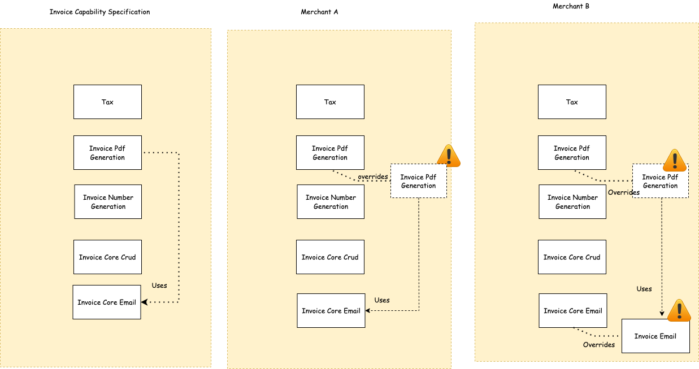
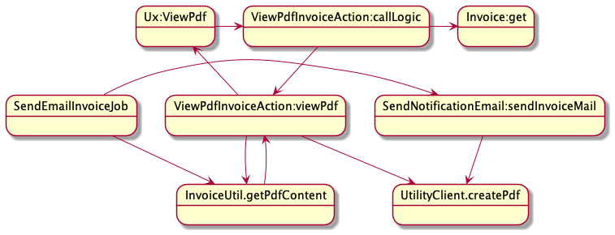
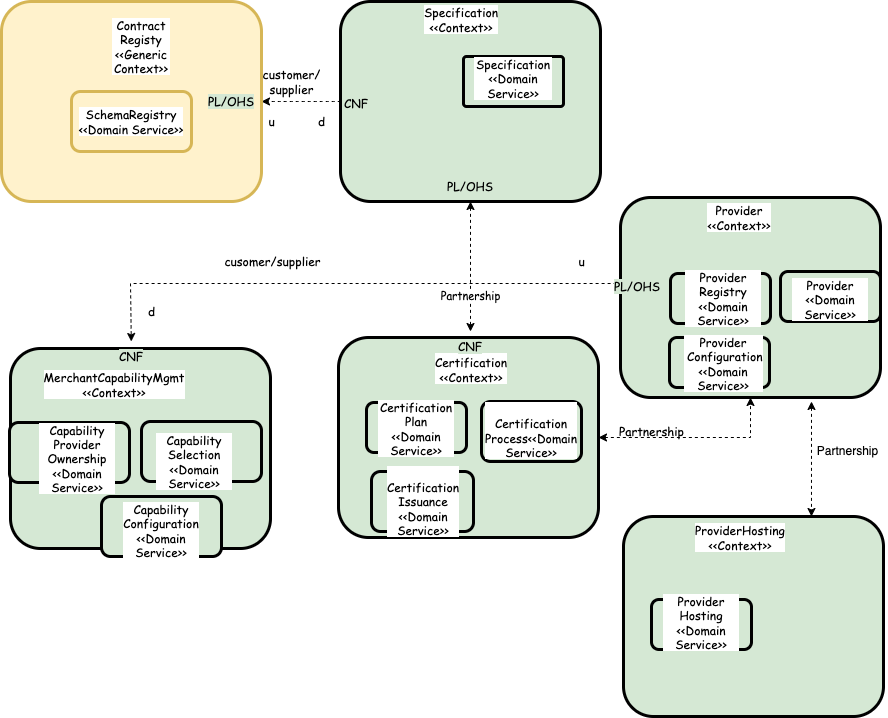

# Business Objective #
Hubble is aimed to make Chargebee an extensible platform with deep possible integrations. Hubble is envisioned to provide set of self serve to enable internal or external developers faster. 

## Guiding Principles ##
* We will actively discourage the word integrations. Integration becomes an implementation and needlessly decreases the business efficiency by adding technical debt in the system.  
*Eg-We will not say we are integrating with RevLock, we will say we are enhancing with Revenue Recognition Capability. This identifies and promotes the true problem to be solve for.*  

* Any business enablement we will think in terms of composition of capabilities. 
  
* Any capability we will define in terms of Open Interfaces. This promotes bounded context. This also demands clean and simpler interfaces. Clean interface is one which does not reveal the implementation detail thus discouraging accidental complexity seeping into the system.  
  
* Capabilities that can be extensible are expressible and readable by machine. This is needed to automate.  
  
* Capabilities expressed hides the implementation details. There can be multiple implementation for the same capability.  
  
* We measure inconvenience in terms of our in adaptability to change or too many changes because of  underlying implementation. Higher the inconvenience further we are from the goal!
  
* Capability Interfaces are most of the time backward compatible, are versioned and promotes selectivity.  
  
* We will use the above principles for evaluation of Commercial Off the Shelf (COTS) as well.  

### Overall Context ###

# Scenarios #

## Invoice - Pdf Generation - Externalization ##
* Merchant configures logo
* Merchant configures Note
* Merchant configures Payment Instruction in terms of due payment
** What needs to be done when logo changes freshdesk vs freshworks ** 

### Ways to Solve ###

## Notification ##

## Tax Providers ##

* Merchant Configures Nexus. Nexus are generally pincode for which tax calculation needed not be done.
* Merchant can mark a Customer as exempt from tax or not. A specic exemption code is configured for the merchant.
* Merchant Adds a TaxCode for Line Item based on which tax provider calculates the tax. Product Catalog to tax Calculation mapping
* Merchant configures details to connect to the customer
* Some Providers support Tax Invoice Sync
* Merchant Configures the credential to connect with provider

## Shipment ##

## Payment Gateway ## 

# Case Studies #

## Shopify ##
## Tax Provider ##
## Wordpress plugin Mode ##

# Extensibility Pattern #

## Sync Function Provider ##
## Async Function Provider ##
## Async Function Provider via Event Consumption ##
## Async Function Provider with Result Update #
## Provider with Meta Data Provisioning ## 
## Supporting Domain Provider ##
## Provider with Hosted Functions ##
## Adorning Provider ##

# Key Architecture Decisions #

* Multi platform - chargebee, numberz etc.
* Multi tenant/Entity and Multi Cloud
* Should be self hosted Extensibility layer should be easier for Main  Apps to consume through simple set of sdks (frontend/backend)
* Automation and API first
* System is expected to make progress to recover from failures
* Systems fail in isolation and does not cascade failure
* System is observable under  all circumstance.

# 

# Context #

## Points of Delibration ##

* ___*Specification and Certification in separate Context vs Same Context*___. Specification Context is all about providing support for writing specification. This involves providing support to define a capability. Certification context needs provide support on certifying a provider on whether he is adhering to the Specification. Relationship between them is **partnership

# System Diagram #

## Components ##

## Capability Specification ##

# List of Proof Of Concept #

# Misc #
https://drive.google.com/file/d/1kbp9bVRdoR1LKZusq38WqN8t4tf9wiO6/view?usp=sharing
Draw.io diagram
# Plan Of Attack - RoadMap #

